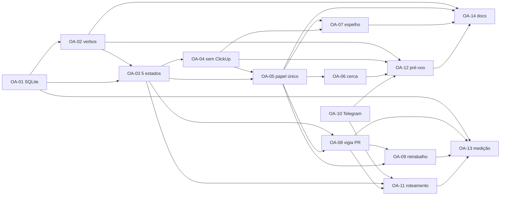

# Orquestrador ágil — mapa da entrega

Refinamento dos requisitos de 21/09/2026 em catorze unidades executáveis. Cada uma tem um
arquivo próprio com desenho, critérios de aceite prováveis e riscos.

**O que esta entrega faz, em uma frase:** o orquestrador deixa de ser uma esteira de quatro
estágios guiada pelo ClickUp e passa a ser um despachante de agentes auto-contidos, com
estado em SQLite, gate humano no pull request e aviso no Telegram.

## As decisões já tomadas

Estas não são suposições: foram respondidas em 21/09/2026 e valem para todas as unidades.

| Assunto | Decisão |
| --- | --- |
| Estado | **SQLite substitui o `pipeline.toml` por inteiro.** Um banco por esteira, em `~/.config/orquestrador/esteiras/<nome>.db` |
| Concorrência | Transação com `BEGIN IMMEDIATE` + WAL + `busy_timeout`; a fila é o kernel, não um daemon |
| ClickUp | O motor não fala mais com ele. Quem escreve no quadro é o agente, por `orq-clickup` |
| Papéis | Um só, auto-contido: lê o cartão, implementa, roda a verificação do próprio `CLAUDE.md`, abre o PR, atualiza o quadro |
| Gates | O orquestrador **deixa de se preocupar com eles**. Setup e verify são responsabilidade do agente, seguindo o `CLAUDE.md`/`AGENTS.md` que o projeto já declara — não configuração da esteira. Teardown de ambiente continua com o orquestrador, mas vira comando fixo (`docker-compose*.yml` → `down`), nunca declarado por esteira. Decisão de 22/09/2026 |
| Status | `backlog`, `em_progresso`, `revisao`, `pronto`, `bloqueado` — e o ClickUp espelha os cinco com o mesmo nome |
| Merge | Gate **humano**. Nenhum agente funde; a cerca barra `gh pr merge` sem exceção |
| PR devolvido | `CHANGES_REQUESTED` relança o agente com os comentários; PR fechado sem merge bloqueia |
| Vigia de PR | Dentro do laço, a cada 60s, por `gh` |
| Telegram | Canal padrão de **todos** os avisos do motor — exceto sessão pedindo decisão, que já chega pelo app |
| Migração | Não há esteira viva para migrar: começa limpo, sem caminho de compatibilidade |
| Planejamento | A sessão que declara cartões e unidades fica **fora** desta entrega; a declaração se faz pelos verbos de OA-02 |

## As unidades

| id | requisito | prioridade | depende de | estado |
| --- | --- | --- | --- | --- |
| [OA-01](OA-01-nucleo-sqlite.md) | Núcleo de estado em SQLite | P0 | — | concluído (`bin/orq`, `testes/test_estado.py`) |
| [OA-02](OA-02-verbos-de-declaracao.md) | Verbos de declaração e configuração | P0 | OA-01 | não iniciado |
| [OA-03](OA-03-maquina-de-cinco-estados.md) | Máquina de cinco estados e quadro derivado | P0 | OA-01, OA-02 | não iniciado |
| [OA-04](OA-04-motor-sem-clickup.md) | O motor deixa de falar com o ClickUp | P0 | OA-03 | não iniciado |
| [OA-05](OA-05-papel-unico-auto-contido.md) | O papel único auto-contido | P0 | OA-03, OA-04 | não iniciado |
| [OA-06](OA-06-cerca-do-papel-unico.md) | A cerca do papel único | P0 | OA-05 | não iniciado |
| [OA-07](OA-07-espelho-de-cinco-status-no-clickup.md) | Espelho de cinco status no ClickUp | P1 | OA-04, OA-05 | não iniciado |
| [OA-08](OA-08-vigia-de-pr-no-laco.md) | O vigia de PR dentro do laço | P0 | OA-03, OA-05 | não iniciado |
| [OA-09](OA-09-retrabalho-a-partir-do-pr.md) | Retrabalho a partir do PR | P1 | OA-05, OA-08 | não iniciado |
| [OA-10](OA-10-telegram-como-destino.md) | Telegram como destino de aviso | P1 | — | não iniciado |
| [OA-11](OA-11-roteamento-de-eventos-e-avisos.md) | Roteamento de eventos: o que avisa e o que cala | P0 | OA-03, OA-08, OA-10 | não iniciado |
| [OA-12](OA-12-pre-voo-do-modelo-novo.md) | O pré-voo do modelo novo | P1 | OA-02, OA-04, OA-06, OA-10 | não iniciado |
| [OA-13](OA-13-medicao-adaptada.md) | A medição adaptada | P2 | OA-01, OA-08, OA-09, OA-11 | não iniciado |
| [OA-14](OA-14-documentacao-e-skills.md) | Documentação e skills | P2 | OA-02, OA-05, OA-07, OA-12 | não iniciado |

## O mapa de dependências

Lido de cima para baixo: cada unidade só começa depois que todas as setas que chegam nela
terminaram.

```
onda 1     OA-01 (SQLite)                    OA-10 (Telegram)
             │                                  │
onda 2     OA-02 (verbos) ──┐                   │
             └──> OA-03 (cinco estados) <───────┼── (OA-01)
                    │                           │
onda 3     ┌────────┼───────────────┐           │
           v        v               v           │
        OA-04 ── OA-05 ── OA-06     OA-08 ──────┼──> OA-11
      (sem CU)  (papel)  (cerca)   (vigia PR)   │  (roteamento)
           │        │       │         │         │
onda 4     │        └───────┼─────────┼─> OA-09 (retrabalho)
           ├──> OA-07 (espelho ClickUp)│
           └──> OA-12 (pré-voo) <──────┴── (OA-02, OA-06, OA-10)
                  │                    └──> OA-13 (medição)
                  └──> OA-14 (docs) <────── (OA-05, OA-07)
```

Em grafo, para quem preferir:



## Ordem sugerida

Quatro ondas, cada uma entregando algo que se pode demonstrar. Dentro de uma onda as setas
do mapa continuam valendo — só é paralelo o que não tem seta entre si (na onda 3, OA-08
corre ao lado de OA-04→OA-05→OA-06; OA-11 espera OA-08).

| Onda | Unidades | O que existe ao fim dela |
| --- | --- | --- |
| 1 | **OA-01**, **OA-10** | O estado transacional de pé e o canal de aviso funcionando. São as duas raízes independentes — comece pelas duas juntas |
| 2 | **OA-02**, **OA-03** | Dá para declarar uma esteira e ler o quadro, sem despachar nada |
| 3 | **OA-04**, **OA-05**, **OA-06**, **OA-08**, **OA-11** | O ciclo de ponta a ponta: despacha, o agente trabalha, abre PR, o humano funde, a unidade fica pronta e avisa |
| 4 | **OA-07**, **OA-09**, **OA-12**, **OA-13**, **OA-14** | O espelho no quadro, o retrabalho, o pré-voo honesto, a medição e a documentação |

**O primeiro momento em que a esteira anda de verdade é o fim da onda 3.** Antes disso não
há entrega demonstrável — é a consequência de trocar a raiz do sistema, e vale saber disso
antes de começar, não no meio.

## O que continua aberto

Decidi por conta própria, e cada uma está marcada no spec correspondente. Se alguma estiver
errada, o conserto agora é barato.

| # | Suposição | Onde | Se estiver errada |
| --- | --- | --- | --- |
| 1 | A worktree é **removida** quando a unidade fica pronta (hoje nenhuma é removida) | OA-08 | Guardar as worktrees enche o disco de cópias de trabalho fundidas; se quiser mantê-las, é `orq config set` |
| 2 | Unidade em `revisao` conta como **trabalho vivo** para a parada por ociosidade | OA-08 | Sem isso o laço morre em 20 minutos toda vez que o gate humano demora, e ninguém vê o merge |
| 3 | `interval_seconds` passa a **60** por padrão | OA-08 | O requisito pede 1 minuto para o vigia; se o despacho a cada 60s for agressivo demais, separa-se a cadência do vigia da do despacho |
| 4 | Quarentena e retrabalho deixam de ser estados e viram `bloqueado` + `motivo` | OA-03 | Se o quadro precisar distinguir os dois, é coluna, não status novo |
| 5 | PR **aprovado e não fundido** deixa a unidade em `revisao` | OA-09 | Tratar aprovação como pronto marcaria como integrado código que não está na base |
| 6 | O Telegram avisa **mais** do que os três eventos do requisito (inclui falha operacional) | OA-11 | `orq config set avisos <lista>` corta; os três do requisito nunca são cortáveis |
| 7 | Não existe `orq import` — `orq export` é só de saída | OA-02 | Um caminho de volta reintroduziria o arquivo que a decisão eliminou |
| 8 | A prova de ClickUp sai do `orq doctor` e vira `orq-clickup doctor` | OA-12 | Deixá-la fatal impediria despacho por indisponibilidade de ferramenta de gestão |
| 9 | O encerramento fixo de ambiente só conhece Docker Compose (busca por `docker-compose*.yml`/`compose*.yml`) | OA-08 | Projeto que suba serviço por outro meio fica sem encerramento automático; o sinal aparece em `orq sweep`, não em silêncio |
| 10 | `orq validate` exige `CLAUDE.md`/`AGENTS.md` na raiz do projeto — é o único lugar de onde o agente tira os portões agora | OA-02 | Projeto sem nenhum dos dois nunca teria portão nenhum; a recusa antecipa isso em vez de deixar o agente descobrir sozinho |

## A perda que esta entrega aceita

Duas, escritas aqui para não serem redescobertas como defeito:

1. **O grafo de dependências deixa de passar por revisão de código.** Era a razão de o
   `pipeline.toml` viver no repositório. Mitigação disponível: `orq export` produz texto
   estável e difável, e a tabela `evento` registra quem mudou o quê e quando.
2. **A revisão independente deixa de existir como sessão.** Quem implementa é quem revisa,
   e a única barreira real entre o agente e a base passa a ser a pessoa que olha o PR. A
   taxa de devolução (OA-13) é o termômetro: se subir, a resposta é voltar com um revisor
   automático antes do PR — nunca afrouxar o gate humano.
